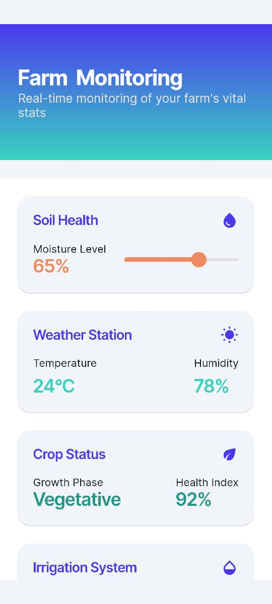
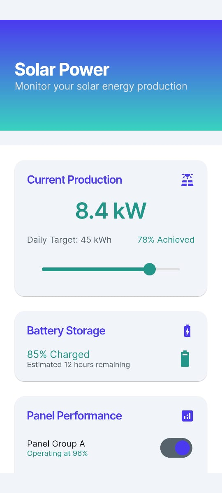
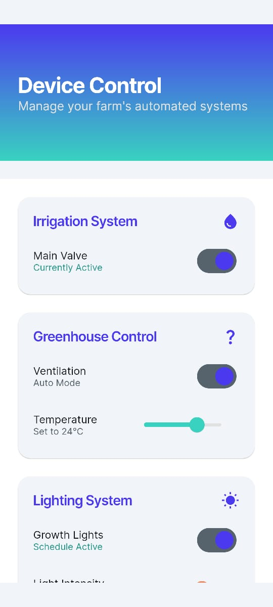

# 🌱 EcoFarmX – Smart Farming for a Greener Future

## 🚀 Project Summary
EcoFarmX is a real-time smart farming system that monitors temperature, humidity, and soil moisture using IoT sensors. It empowers farmers to make eco-friendly decisions that improve crop yield, reduce water waste, and promote sustainable agriculture practices.

---

## 🌍 Problem Statement
Farmers, especially in rural areas, lack access to real-time soil and climate data, leading to over-irrigation, under-watering, and poor crop health. This results in environmental damage and reduced productivity.

---

## 💡 Our Solution
EcoFarmX uses low-cost IoT sensors (ESP32, soil moisture, temperature, and humidity sensors) to collect live field data. The data is visualized on a user-friendly mobile app (built using FlutterFlow) to help farmers make quick, informed decisions.

---

## 🔧 Tech Stack
- 📱 **FlutterFlow** – Mobile App UI
- 🔥 **Firebase** – Realtime Database
- 🧠 **ESP32 + Sensors** – Temperature, Humidity, Soil Moisture
- ☀️ **Solar Power** – Optional sustainable hardware power
- 🌐 **GitHub** – Project Repository

---

## 📸 Screenshots
> Upload your screenshots in the repository and link them below:
- 
- 
- 
- 
- 
- 
- 

---

## 🧠 Innovation Highlights
- Live data monitoring from farm to phone 📲
- Solar-powered hardware for eco-sustainability ☀️
- Scalable for small and large farms 🌾
- Easy-to-use interface for non-tech farmers 👨‍🌾

---

## 🌱 Environmental Impact
- Reduces excessive water usage by alerting moisture status
- Promotes sustainable farming practices
- Increases yield while conserving natural resources

---

## 📝 Submission Details
- 👤 **Participant**: Champia MN
- 🧠 **Project Name**: EcoFarmX
- 🏆 **Event**: DigiGreen National Hackathon 2025
- 🔗 [GitHub Repository Link](https://github.com/YourUsername/YourRepoName)

---

## 📽️ Optional: Demo Video
> Upload your screen-recorded demo and add the link here (Google Drive or YouTube)
- [Watch Demo Video](https://drive.google.com/your-demo-link)

---

## 📩 Contact
Have questions? Reach out to champiamn@email.com
